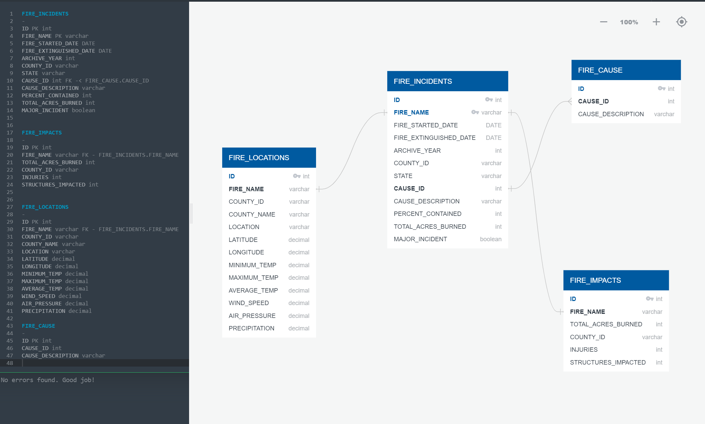

# California Wild Fires

## Project Outline
   It is said that forest soils recover from fire disturbances as slowly as up to 80 years. On an average California has lost 4000 acres of forest land over a period of 7 years. Considering this alarming data, analyzing the trend and impacts of forest fire is very intriguing. 
   Problem statement is to understand how are weather conditions contributing to the increase in wildfires and how human negligence can lead to a great deal of harm to the nature. 
   Deeper analysis include how wildfires are affecting ecosystem as well as the infrastructure.
   Our project provides a detailed analysis of all these factors and it can be used to expand the research for other states
   that pose a threat of wildfires.
   
   

## Preliminary Data Preprocessing

1. Data load : We have used Python pandas to load data from the following sources into two different dataframes. We have retrieved weather and other geographical data through API 
   to get more information about the past weather conditions , so that we can make analyse and make better predictions.			   	
 
	[Kaggle data source](https://www.kaggle.com/ananthu017/california-wildfire-incidents-20132020)
	
	[CA gov data source](https://gis.data.ca.gov/datasets/CALFIRE-Forestry::recent-large-fire-perimeters-5000-acres/about)
	
	[Weather data](https://www.worldweatheronline.com/developer/api/)
	
	[Geographical coordinates](https://simplemaps.com/data/us-counties)
	
	
2. Removal of data duplication : We have consolidated the data from various sources by removing duplicates to maintain accuracy and to avoid misleading statistics. 

3. Handling null values : To maintain performance and accuracy of ML model we have replaced/dropped the null values with some appropriate values based on their column type.

4. Treat missing values : Filled in some missing values required for our analysis using weather API and a python library for weather data called MeteoStat.

5. Merge/Join Dataset : We have combined data frames using pandas merge function based on common columns so that we can incorporate additional data and information in our final
                        dataset.
						
6. Statistical Summary: We have generated a descriptive statistics of our final dataframe showing the statistical details like count, mean, standard deviation, min, max and
                        quartiles.
						
				
						
## Database Description

We have chosen PostgreSQl relational database system to store data for our project. We are using psycopg2 as the adapter to connect the database with our Python code and using SQLAlchemy which is a Python SQL toolkit to facilitate the communication between pandas and the database.

Our database is named Wildfire_db that stores the static data in four different tables , for our use during the course of the project. 
Below is the entity relation diagrams, showing the relationship between the four tables and their columns:

   
	
	
						
## Machine Learning Description

1. Preliminary feature engineering and Preliminary feature selection :

   We have designed our Machine Learning model that will predict whether a major fire can take place in the state of California based on weather conditions.
   The features that we have selected to make the prediction are month in which the fire actually took place, maximum temperature, wind speed and precipitation. 
   These features are based on the past data for the year 2013-2019 when the fire took place in different counties of California. Using these features from the historical data,
   we have trained our model to predict whether a major fire can occur. Our target field is the major fire which we have created based on the total acres burned in each county
   for these past years. We have encoded the features using label encoder, converting them to a numeric machine-readable form.

2. Splitting of data into training and testing sets

   Using Scikit-learn train_test_split method we have split the data into training and testing data. Random state 42 has been used to produce same results across different runs
   along with the stratify parameter so that the training and test subsets that have the same proportions of class labels as the input dataset.
   
3. Model Choice :

   We have selected the Logistic Regression method to predict the major fire which is mainly dependent on the past weather parameters. The reason for selecting this model is that our
   dependent variable is binary and the observation are independent of each other. Logistic regression helps predicting the likelihood of events by looking at historical data points
   and is the best model for binary classification. The benefits of selecting this model are :
   
   - The logistic regression model is simple to understand, easy to implement, and efficient to train
   - Provides good accuracy for smaller datasets
   - Less prone to overfitting in low dimensional datasets
   - Can be extended to multi-class classification
   - It makes no assumptions about distributions of classes 
   
   The limitations of the model are :
   
   - 
   

## Interactive elements and tool to create visualizations and dashboard
   - We used Seaborn python library to depict relationship between our variables.
   
   - We have used Tableau, a powerful visualization tool to showcase our findings. It includes a timeline of all the years and how a click refreshes the whole dashboard depicting wildfire causes and effects.
   - It can dig into county wise details by hovering over the map of California. 
   - It also includes graphic visuals for effects of wildfire which are easily caught by human eye.

## Communication Protocol

## Resources

- **Google Slides:** [View Google Slides](https://docs.google.com/presentation/d/1GVM7zW76ahHW7EQw37eZMHLR06Flqr9Tug5ImQGsppc/edit?usp=sharing)
- **Storyboard of Dashboard:** [View Storyboard](https://docs.google.com/presentation/d/1Pq6c_P56_Bx2GsKr0kPmHrszo_ZAOSP_QyOfqmEMr9o/edit?usp=sharing)